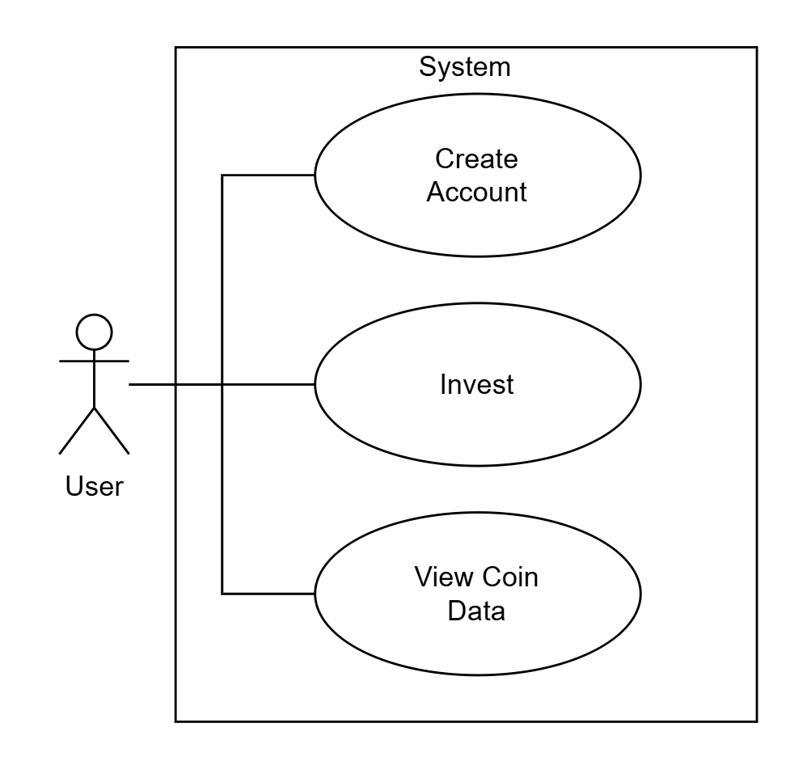

# CryptoBrokerProject

## Softwareanforderungen

### 1. Einleitung

#### 1.1 Übersicht

Das **CryptoBrokerProject** ist eine webbasierte Anwendung, die über einen Browser genutzt wird.
Benutzer können Kryptowährungsdaten einsehen, Konten verwalten und Investitionen simulieren.
Die Anwendung nutzt eine serverseitige Architektur.  

#### 1.2 Geltungsbereich

Dieses Dokument beschreibt die funktionalen und nicht-funktionalen Anforderungen des gesamten Systems.  
Es dient der Umsetzung einer Webanwendung zur plattformunabhängigen Verwaltung und Anzeige von Kryptodaten über moderne Webbrowser.

#### 1.3 Definitionen und Abkürzungen

| Begriff | Bedeutung |
|----------|------------|
| **DB** | Datenbank |
| **GUI** | Graphical User Interface |
| **UML** | Unified Modeling Language |
| **BLOB** | Binary Large Object (z. B. Bilder) |

#### 1.4 Projektvision

Die Vision des **CryptoBrokerProject** ist die Entwicklung einer verständlichen und realitätsnahen
Krypto-Broker-Simulation, die es Nutzern ermöglicht, grundlegende Konzepte des
Kryptowährungshandels kennenzulernen, ohne echtes finanzielles Risiko einzugehen.

Die Anwendung soll insbesondere:
- den Ablauf von Kauf- und Verkaufstransaktionen transparent darstellen,
- Preisentwicklungen von Kryptowährungen nachvollziehbar visualisieren,
- den Einfluss von Handelsentscheidungen auf ein virtuelles Portfolio aufzeigen.

Der Fokus liegt auf **Lernbarkeit, Nachvollziehbarkeit und einfacher Bedienung**.
Das System richtet sich nicht an professionelle Trader, sondern an Studierende und Einsteiger,
die ein grundlegendes Verständnis für Kryptowährungen, Portfolios und Handelsmechanismen
entwickeln möchten.

Das CryptoBrokerProject ist ausdrücklich **kein produktiver Broker** und dient ausschließlich
zu **Lehr-, Übungs- und Demonstrationszwecken** im Kontext der Software-Engineering-Vorlesung.

---

### 2. Funktionale Anforderungen

#### 2.1 Übersicht

Das System umfasst mehrere zentrale Hauptfunktionen, wie im folgenden **UML-Anwendungsfalldiagramm** dargestellt:

Hauptanwendungsfälle:

1. **Create Account**  
2. **Crypto Kaufen**  
3. **Crypto Verkaufen**
4. **View Crypto Data**
5. **Login**
6. **Logout**
7. **Crypto Watchlist**

---

#### 2.2 Create Account

- **Beschreibung:** Benutzer können ein Konto anlegen, um personalisierte Daten zu speichern. Sodass ihr Investitionsverlauf und Einstellungen erhalten bleiben.
- **Voraussetzung:** Die Anwendung ist gestartet. Kein bestehendes Konto mit derselben E-Mail-Adresse.
- **Nachbedingung:** Der Benutzer wird in der Datenbank registriert und ist bereit zum investieren.
- **Aufwand:** Niedrig  

#### 2.3 Crypto Kaufen

- **Beschreibung:** Benutzer können Investitionen in Kryptowährungen simulieren oder speichern.
- **Voraussetzung:** Ein Benutzerkonto existiert und ausreichenden Kontostand.  
- **Nachbedingung:** Investitionsdaten werden in der Datenbank gesichert.  
- **Aufwand:** Mittel  

#### 2.4 Crypto Verkaufen

- **Beschreibung:** Benutzer können ihre bereits gekauften Kryptowährungen wieder verkaufen.
- **Voraussetzung:** Ein Benutzerkonto existiert und gekaufte Kryptowährungen.
- **Nachbedingung:** Eine Verkaufs-Transaktion wird in der Datenbank gespeichert.
- **Aufwand:** Mittel

#### 2.5 View Crypto Data

- **Beschreibung:** Benutzer können Kryptoinformationen (z. B. Preise, Symbole, Bilder) einsehen.  
- **Voraussetzung:** Die Datenbank ist initialisiert.  
- **Nachbedingung:** Daten werden aus der DB gelesen und angezeigt.  
- **Aufwand:** Niedrig  

#### 2.6 Login

- **Beschreibung:** Benutzer können sich mit ihren Anmeldedaten in ihr Konto einloggen, um auf personalisierte Funktionen zuzugreifen.
- **Voraussetzung:** Die Anwendung ist gestartet. Ein bestehendes Konto mit der eingegebenen E-Mail-Adresse.
- **Nachbedingung:** Der Benutzer wird authentifiziert und erhält Zugriff auf sein Konto.
- **Aufwand:** Niedrig

#### 2.7 Logout

- **Beschreibung:** Benutzer können sich aus ihrem Konto ausloggen, um die Sitzung zu beenden.
- **Voraussetzung:** Der Benutzer ist eingeloggt.
- **Nachbedingung:** Die Sitzung wird beendet und der Benutzer wird zur Anmeldeseite zurückgeleitet.
- **Aufwand:** Niedrig

#### 2.8 Crypto Watchlist

- **Beschreibung:** Benutzer können eine Watchlist erstellen, um bestimmte Kryptowährungen zu verfolgen.
- **Voraussetzung:** Der Benutzer ist eingeloggt.
- **Nachbedingung:** Die Watchlist wird in der Datenbank gespeichert und kann jederzeit abgerufen werden. Sieht den aktuellen Preisverlauf der Kryptowährungen in der Watchlist abhängig vom Startzeitpunkt der Beobachtung.
- **Aufwand:** Mittel

---

### 3. Nicht-funktionale Anforderungen

| Kategorie | Beschreibung |
|------------|--------------|
| **Benutzerfreundlichkeit** | Einfache, übersichtliche GUI in HTML / CSS |
| **Zuverlässigkeit** | Datenhaltung über SQLite und Validierung bei Fehleingaben |
| **Leistung** | Antwortzeiten unter 2 Sekunde |
| **Sicherheit** | Keine sensiblen Datenübertragungen, Passwörter gehasht |
| **Wartbarkeit** | Trennung in Frontend / Backend |

---

### 4. Technische Einschränkungen

- Systemtyp: **Webanwendung (Client–Server)**
- Frontend: **HTML, CSS, JavaScript**
- Backend: **Python + Flask**
- Datenbank: **SQLite**  
