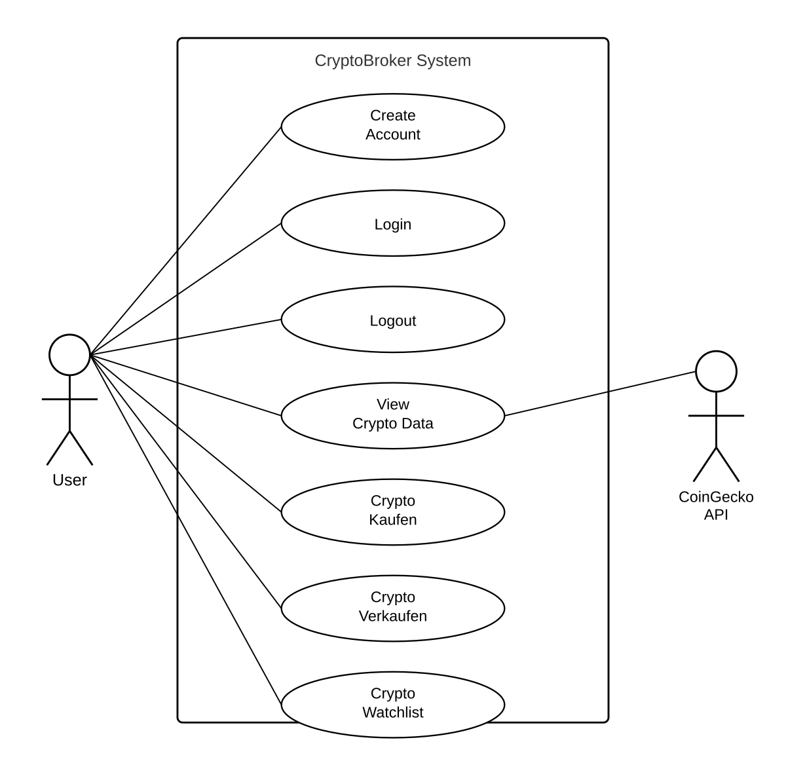
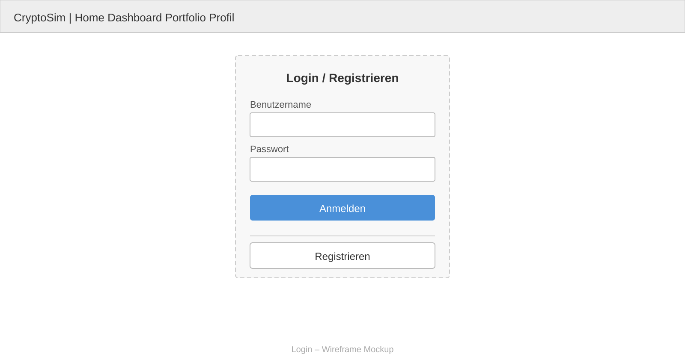
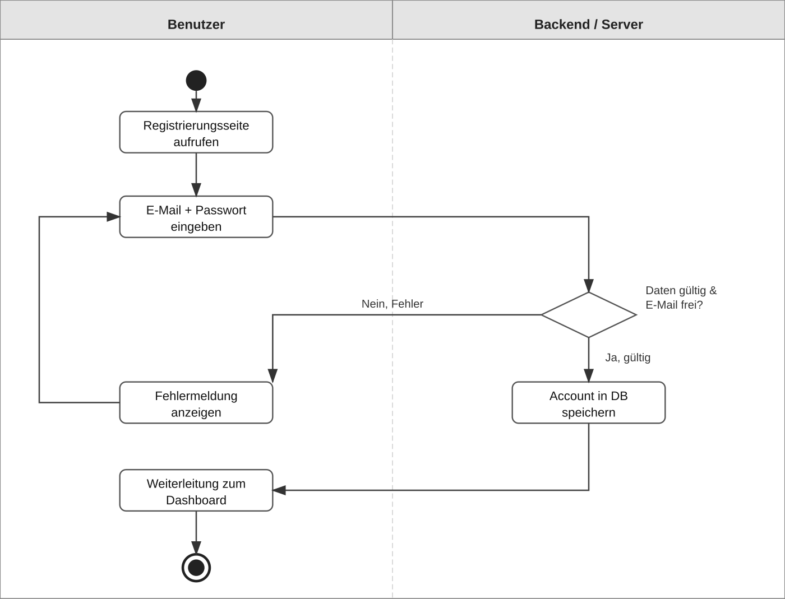
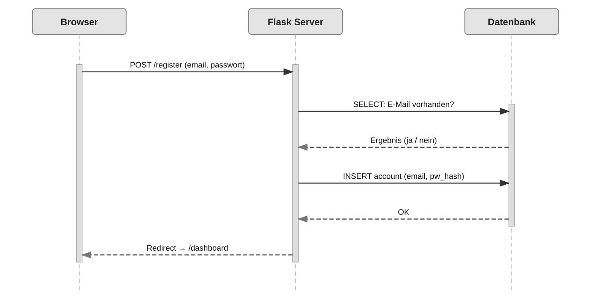
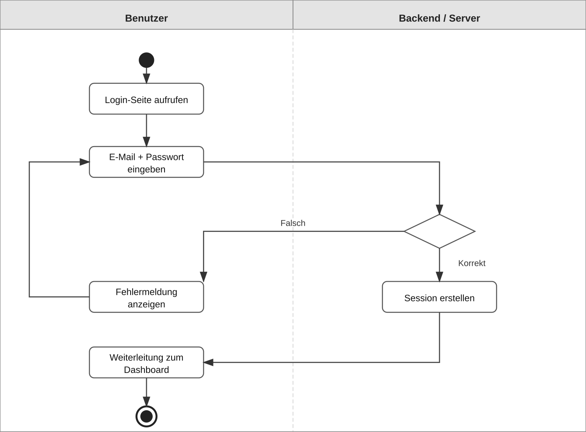
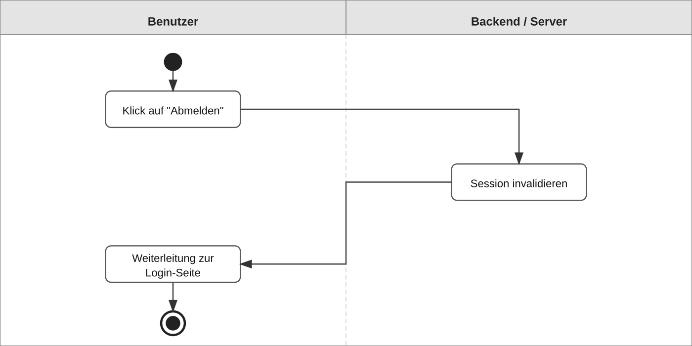
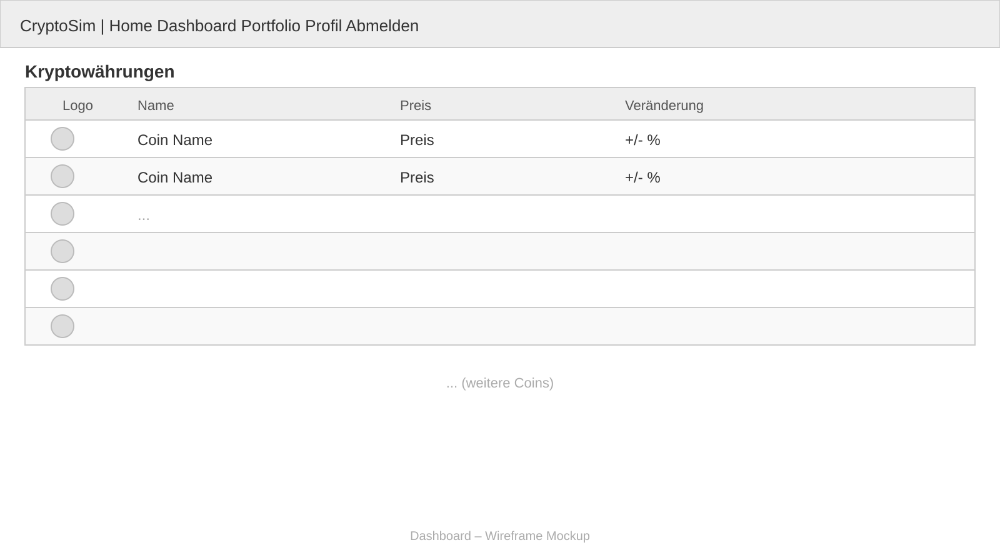
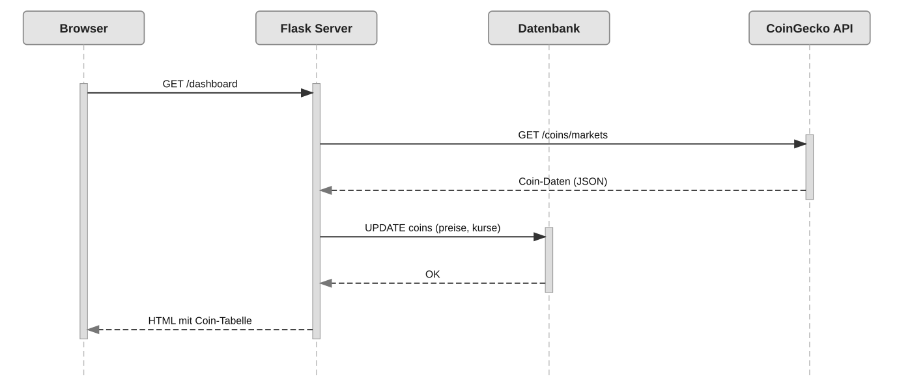
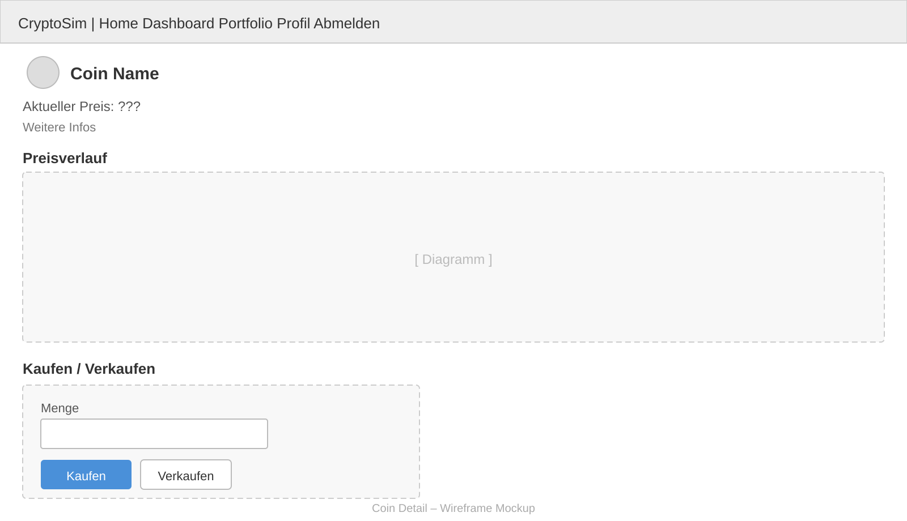
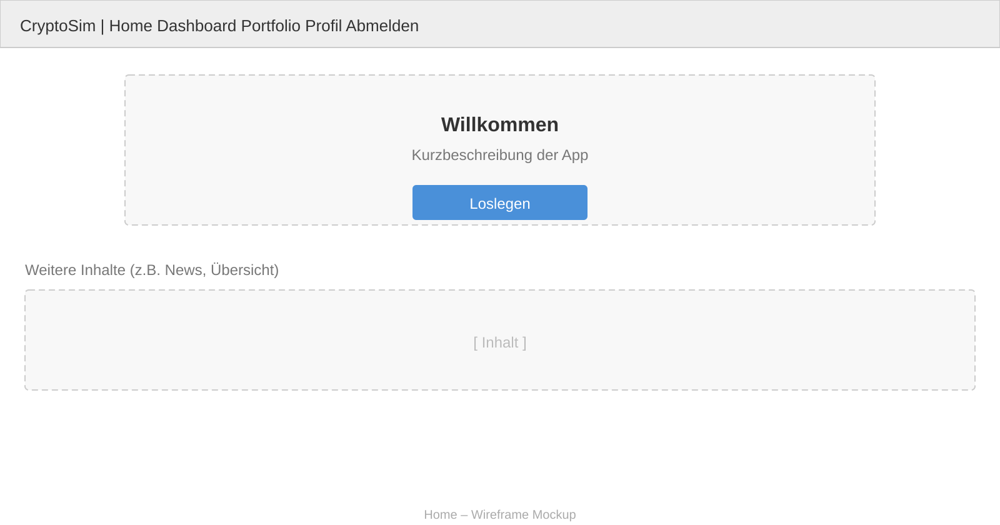

# CryptoBrokerProject

## Softwareanforderungen

### 1. Einleitung

#### 1.1 Übersicht

Das **CryptoBrokerProject** ist eine webbasierte Anwendung, die über einen Browser genutzt wird.
Benutzer können Kryptowährungsdaten einsehen, Konten verwalten und Investitionen simulieren.
Die Anwendung nutzt eine serverseitige Architektur.

Die Vision des Projekts ist die Entwicklung einer verständlichen und realitätsnahen
Krypto-Broker-Simulation, die es Nutzern ermöglicht, grundlegende Konzepte des
Kryptowährungshandels kennenzulernen, ohne echtes finanzielles Risiko einzugehen.

#### 1.2 Geltungsbereich

Dieses Dokument beschreibt die funktionalen und nicht-funktionalen Anforderungen des gesamten Systems.
Es dient der Umsetzung einer Webanwendung zur plattformunabhängigen Verwaltung und Anzeige von Kryptodaten über moderne Webbrowser.

#### 1.3 Definitionen und Abkürzungen

| Begriff | Bedeutung |
|----------|------------|
| **DB** | Datenbank |
| **GUI** | Graphical User Interface |
| **UML** | Unified Modeling Language |
| **SRS** | Software Requirements Specification |
| **DoD** | Definition of Done |
| **API** | Application Programming Interface |

#### 1.4 Referenzen

- Scrum Board: https://github.com/Lucas-Klein1/CryptoBroker

---

### 2. Funktionale Anforderungen

#### 2.1 Übersicht

Das System umfasst mehrere zentrale Hauptfunktionen, wie im folgenden **UML-Anwendungsfalldiagramm** dargestellt:

Hauptanwendungsfälle (ohne Benutzeranmeldung):

1. **View Crypto Data**
2. **Crypto Kaufen**
3. **Crypto Verkaufen**
4. **Crypto Watchlist**
5. **Create Account**

---

#### 2.2 Create Account

**User Story** *(GitHub Issue #9)*:
> „Als Nutzer möchte ich einen Account erstellen können, damit ich den CryptoBroker personalisiert nutzen kann."

**Schätzung:** 3 Story Points · Aufwand: mittel

**Beschreibung:** Benutzer können ein Konto anlegen, um personalisierte Daten zu speichern, sodass ihr Investitionsverlauf und ihre Einstellungen erhalten bleiben.

**Voraussetzung:** Die Anwendung ist gestartet. Kein bestehendes Konto mit derselben E-Mail-Adresse.
**Nachbedingung:** Der Benutzer wird in der Datenbank registriert und ist bereit zum Investieren.

**GUI-Mockup:**

**Verhaltensdiagramme:**

Aktivitätsdiagramm – Registrieren:

Das Aktivitätsdiagramm zeigt den Registrierungsablauf in zwei Swimlanes (Benutzer / Backend). Der Nutzer ruft die Registrierungsseite auf und gibt E-Mail und Passwort ein. Das Backend prüft die Passwortvorgaben und ob die E-Mail bereits in der Datenbank vorhanden ist. Bei Erfolg wird der Account gespeichert und der Nutzer zum Dashboard weitergeleitet; bei Fehlern wird eine Meldung angezeigt.

Sequenzdiagramm – Create Account:

Das Sequenzdiagramm zeigt die technische Kommunikation beim Account-Anlegen: Der Browser sendet E-Mail und Passwort per POST an den Flask Server. Dieser prüft per SELECT ob die E-Mail bereits vergeben ist, speichert den Account mit gehashtem Passwort per INSERT in der Datenbank und leitet bei Erfolg zum Dashboard weiter. Aktivitäts- und Sequenzdiagramm ergänzen sich: das Aktivitätsdiagramm zeigt die Logik aus Nutzersicht, das Sequenzdiagramm die technischen Aufrufe zwischen den Komponenten.

**Definition of Done:**
- Registrierungsformular mit E-Mail und Passwort ist funktionsfähig
- Passwort wird gehasht in der Datenbank gespeichert
- Doppelte E-Mail-Adressen werden abgewiesen
- Mindestens 2 Unit-Tests vorhanden und bestanden
- Code von mindestens zwei Teammitgliedern geprüft

---

#### 2.3 Login

**User Story:**
> „Als Nutzer möchte ich mich in meinen Account einloggen können, damit ich auf meine persönlichen Daten und mein Portfolio zugreifen kann."

**Schätzung:** 2 Story Points · Aufwand: niedrig

**Beschreibung:** Benutzer können sich mit ihren Anmeldedaten in ihr Konto einloggen, um auf personalisierte Funktionen zuzugreifen.

**Voraussetzung:** Die Anwendung ist gestartet. Ein bestehendes Konto mit der eingegebenen E-Mail-Adresse.
**Nachbedingung:** Der Benutzer wird authentifiziert und erhält Zugriff auf sein Konto.

**GUI-Mockup:**

**Verhaltensdiagramme:**

Aktivitätsdiagramm – Anmelden:

Das Aktivitätsdiagramm zeigt den Login-Ablauf in zwei Swimlanes (Benutzer / Backend). Nach Eingabe der Anmeldedaten prüft der Server ob der Nutzer in der Datenbank vorhanden ist. Bei korrekten Daten wird eine Session erstellt und der Nutzer zum Dashboard weitergeleitet; bei falschen Daten erscheint eine Fehlermeldung.

**Definition of Done:**
- Login-Formular mit E-Mail und Passwort funktionsfähig
- Fehlerhafte Anmeldedaten werden abgewiesen mit Fehlermeldung
- Session wird korrekt gesetzt
- Code von mindestens zwei Teammitgliedern geprüft

---

#### 2.4 Logout

**User Story:**
> „Als Nutzer möchte ich mich ausloggen können, damit meine Sitzung sicher beendet wird."

**Schätzung:** 1 Story Point · Aufwand: niedrig

**Beschreibung:** Benutzer können sich aus ihrem Konto ausloggen, um die Sitzung zu beenden.

**Voraussetzung:** Der Benutzer ist eingeloggt.
**Nachbedingung:** Die Sitzung wird beendet und der Benutzer wird zur Anmeldeseite zurückgeleitet.

**GUI-Mockup:**

**Verhaltensdiagramme:**

Aktivitätsdiagramm – Abmelden:

Das Aktivitätsdiagramm zeigt den Logout-Ablauf in zwei Swimlanes (Benutzer / Backend). Nach Klick auf den Abmelden-Button invalidiert der Server die aktive Session und leitet den Nutzer zur Login-Seite weiter.

**Definition of Done:**
- Session wird vollständig invalidiert
- Weiterleitung zur Login-Seite nach Logout
- Code von mindestens zwei Teammitgliedern geprüft

---

#### 2.5 View Crypto Data

**User Story** *(GitHub Issue #14)*:
> „Als Nutzer möchte ich eine Übersicht aller Kryptowährungen sehen."

**User Story** *(GitHub Issue #10)*:
> „Als Nutzer möchte ich die App mit Live-Daten aktualisieren."

**Schätzung:** 3 Story Points · Aufwand: mittel

**Beschreibung:** Benutzer können Kryptoinformationen (z. B. Preise, Symbole, Bilder) einsehen. Die Daten werden über eine externe API geladen und aktuell gehalten.

**Voraussetzung:** Die Datenbank ist initialisiert und Live-Kurse wurden von der API geladen.
**Nachbedingung:** Daten werden aus der DB gelesen und angezeigt.

**GUI-Mockup:**

**Verhaltensdiagramme:**

Sequenzdiagramm – Coins anzeigen:

Das Sequenzdiagramm zeigt den Ablauf beim Aufruf des Dashboards: Der Browser sendet ein GET an den Flask Server, der Server ruft aktuelle Preise von der CoinGecko API ab, speichert sie per UPDATE in der Datenbank und gibt das fertige HTML mit der Coin-Tabelle zurück.

**Definition of Done:**
- Kryptowährungen werden mit Name, Symbol und aktuellem Preis angezeigt
- Daten werden automatisch über die externe API aktualisiert
- Code von mindestens zwei Teammitgliedern geprüft

---

#### 2.6 Crypto Kaufen

**User Story** *(GitHub Issue #12)*:
> „Als Nutzer möchte ich über ein virtuelles Guthaben verfügen, mit dem ich wie in einem Planspiel investieren kann."

**Schätzung:** 5 Story Points · Aufwand: hoch

**Beschreibung:** Benutzer können Investitionen in Kryptowährungen simulieren und ihr virtuelles Guthaben einsetzen.

**Voraussetzung:** Ein Benutzerkonto existiert mit ausreichendem virtuellem Kontostand.
**Nachbedingung:** Die Transaktion wird in der Datenbank gespeichert; das Guthaben wird entsprechend reduziert.

**GUI-Mockup:**

**Verhaltensdiagramme:**

Sequenzdiagramm – Coin-Daten abrufen vor dem Kauf:

Bevor ein Kauf durchgeführt werden kann, werden die aktuellen Coin-Daten vom Server geladen. Das Sequenzdiagramm zeigt diesen Ablauf: Der Browser fragt die Daten an, der Server liest sie aus der Datenbank und gibt sie zurück, woraufhin der Nutzer handeln kann.

**Definition of Done:**
- Kauf-Formular mit Eingabe einer Menge funktionsfähig
- Transaktion wird korrekt in DB gespeichert
- Guthaben wird nach dem Kauf aktualisiert angezeigt
- Fehlerfälle (zu wenig Guthaben, ungültige Eingabe) werden abgefangen
- Mindestens 2 Unit-Tests vorhanden und bestanden
- Code von mindestens zwei Teammitgliedern geprüft

---

#### 2.7 Crypto Verkaufen

**User Story:**
> „Als Nutzer möchte ich meine bereits gekauften Kryptowährungen wieder verkaufen, damit ich Gewinne oder Verluste realisieren kann."

**Schätzung:** 5 Story Points · Aufwand: hoch

**Beschreibung:** Benutzer können ihre bereits gekauften Kryptowährungen wieder verkaufen.

**Voraussetzung:** Ein Benutzerkonto existiert und der Nutzer hält die entsprechende Kryptowährung.
**Nachbedingung:** Eine Verkaufs-Transaktion wird in der Datenbank gespeichert; das Guthaben wird entsprechend erhöht.

**GUI-Mockup:**

**Verhaltensdiagramme:**

Aktivitätsdiagramm – Transaktion durchführen (Referenz):

Der Verkaufsvorgang setzt eine aktive Nutzersitzung voraus. Das Aktivitätsdiagramm zeigt den Anmeldeprozess, der dem Handel vorausgeht. Der eigentliche Verkauf folgt dem gleichen Prinzip wie der Kauf: Eingabe einer Menge, Validierung und Speicherung in der Datenbank.

**Definition of Done:**
- Verkauf-Formular funktionsfähig
- Transaktion wird korrekt in DB gespeichert
- Fehlerfälle (zu wenig Coins, ungültige Eingabe) werden abgefangen
- Mindestens 2 Unit-Tests vorhanden und bestanden
- Code von mindestens zwei Teammitgliedern geprüft

---

#### 2.8 Crypto Watchlist

**User Story** *(GitHub Issue #13)*:
> „Als Nutzer möchte ich meine Lieblings-Coins speichern können."

**Schätzung:** 3 Story Points · Aufwand: mittel

**Beschreibung:** Benutzer können eine Watchlist erstellen, um bestimmte Kryptowährungen zu verfolgen und deren Preisverlauf zu beobachten.

**Voraussetzung:** Der Benutzer ist eingeloggt.
**Nachbedingung:** Die Watchlist wird in der Datenbank gespeichert und kann jederzeit abgerufen werden.

**GUI-Mockup:**

**Verhaltensdiagramme:**

Sequenzdiagramm – Coins anzeigen (Grundlage der Watchlist):

Die Watchlist baut auf der Coin-Übersicht auf. Das Sequenzdiagramm zeigt wie Coin-Daten geladen werden – dieselbe Datengrundlage, die genutzt wird um Favoriten anzuzeigen und zu verwalten.

**Definition of Done:**
- Coins können zur Watchlist hinzugefügt und entfernt werden
- Watchlist wird persistent in der DB gespeichert
- Code von mindestens zwei Teammitgliedern geprüft

---

### 3. Nicht-funktionale Anforderungen

| Kategorie | Beschreibung |
|------------|--------------|
| **Benutzerfreundlichkeit** | Einfache, übersichtliche GUI in HTML / CSS |
| **Zuverlässigkeit** | Datenhaltung über eine Datenbank; Validierung bei Fehleingaben |
| **Leistung** | Antwortzeiten unter 2 Sekunden |
| **Sicherheit** | Passwörter gehasht gespeichert; Authentifizierung für geschützte Seiten |
| **Wartbarkeit** | Klare Trennung von Frontend und Backend |

---

### 4. Technische Einschränkungen

- Systemtyp: **Webanwendung (Client–Server)**
- Frontend: **HTML, CSS, JavaScript**
- Backend: **Python + Flask**
- Datenbank: **SQLite**
- Externe API: **CoinGecko** (Live-Kursdaten)