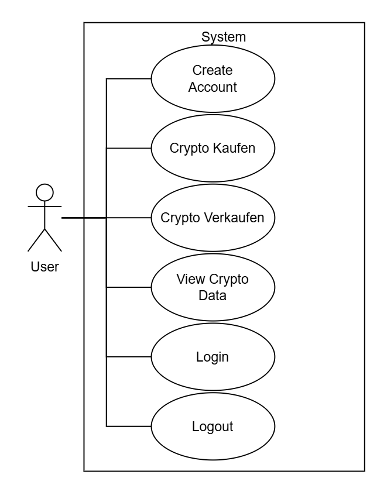

# CryptoBrokerProject

## Softwareanforderungen

### 1. Einleitung

#### 1.1 Übersicht

Das **CryptoBrokerProject** ist eine JavaFX-Anwendung, mit der Benutzer Kryptowährungsdaten einsehen, ein Konto erstellen und Investitionen simulieren können.  
Die Anwendung verwendet eine **lokale SQLite-Datenbank** zur Speicherung von Nutzerdaten und Kryptoinformationen.  

#### 1.2 Geltungsbereich

Dieses Dokument beschreibt die funktionalen und nicht-funktionalen Anforderungen des gesamten Systems.  
Es dient der Umsetzung eines Desktop-Tools zur Verwaltung und Anzeige von Kryptodaten.

#### 1.3 Definitionen und Abkürzungen

| Begriff | Bedeutung |
|----------|------------|
| **DB** | Datenbank |
| **GUI** | Graphical User Interface |
| **UML** | Unified Modeling Language |
| **BLOB** | Binary Large Object (z. B. Bilder) |

---

### 2. Funktionale Anforderungen

#### 2.1 Übersicht

Das System umfasst vier Hauptfunktionen, wie im folgenden **UML-Anwendungsfalldiagramm** dargestellt:

Hauptanwendungsfälle:

1. **Create Account**  
2. **Crypto Kaufen**  
3. **Crypto Verkaufen**
4. **View Crypto Data**
5. **Login**
6. **Logout**
7. **Crypto Watchlist**

---

#### 2.2 Create Account

- **Beschreibung:** Benutzer können ein Konto anlegen, um personalisierte Daten zu speichern. Sodass ihr Investitionsverlauf und Einstellungen erhalten bleiben.
- **Voraussetzung:** Die Anwendung ist gestartet. Kein bestehendes Konto mit derselben E-Mail-Adresse.
- **Nachbedingung:** Der Benutzer wird in der Datenbank registriert und ist bereit zum investieren.
- **Aufwand:** Niedrig  

#### 2.3 Crypto Kaufen

- **Beschreibung:** Benutzer können Investitionen in Kryptowährungen simulieren oder speichern.
- **Voraussetzung:** Ein Benutzerkonto existiert und ausreichenden Kontostand.  
- **Nachbedingung:** Investitionsdaten werden in der Datenbank gesichert.  
- **Aufwand:** Mittel  

#### 2.4 Crypto Kaufen

- **Beschreibung:** Benutzer können ihre bereits gekauften Kryptowährungen wieder verkaufen.
- **Voraussetzung:** Ein Benutzerkonto existiert und gekaufte Kryptowährungen.
- **Nachbedingung:** Investitionsdaten werden aus der Datenbank geslöscht.
- **Aufwand:** Mittel

#### 2.5 View Crypto Data

- **Beschreibung:** Benutzer können Kryptoinformationen (z. B. Preise, Symbole, Bilder) einsehen.  
- **Voraussetzung:** Die Datenbank ist initialisiert.  
- **Nachbedingung:** Daten werden aus der DB gelesen und angezeigt.  
- **Aufwand:** Niedrig  

#### 2.6 Login

- **Beschreibung:** Benutzer können sich mit ihren Anmeldedaten in ihr Konto einloggen, um auf personalisierte Funktionen zuzugreifen.
- **Voraussetzung:** Die Anwendung ist gestartet. Ein bestehendes Konto mit der eingegebenen E-Mail-Adresse.
- **Nachbedingung:** Der Benutzer wird authentifiziert und erhält Zugriff auf sein Konto.
- **Aufwand:** Niedrig

#### 2.7 Logout

- **Beschreibung:** Benutzer können sich aus ihrem Konto ausloggen, um die Sitzung zu beenden.
- **Voraussetzung:** Der Benutzer ist eingeloggt.
- **Nachbedingung:** Die Sitzung wird beendet und der Benutzer wird zur Anmeldeseite zurückgeleitet.
- **Aufwand:** Niedrig

#### 2.8 Crypto Watchlist

- **Beschreibung:** Benutzer können eine Watchlist erstellen, um bestimmte Kryptowährungen zu verfolgen.
- **Voraussetzung:** Der Benutzer ist eingeloggt.
- **Nachbedingung:** Die Watchlist wird in der Datenbank gespeichert und kann jederzeit abgerufen werden. Sieht den aktuellen Preisverlauf der Kryptowährungen in der Watchlist abhängig vom Startzeitpunkt der Beobachtung.
- **Aufwand:** Mittel

---

### 3. Nicht-funktionale Anforderungen

| Kategorie | Beschreibung |
|------------|--------------|
| **Benutzerfreundlichkeit** | Einfache, übersichtliche GUI in JavaFX |
| **Zuverlässigkeit** | Lokale Datenhaltung über SQLite |
| **Leistung** | Antwortzeiten unter 1 Sekunde |
| **Sicherheit** | Keine sensiblen Datenübertragungen, lokale Speicherung |
| **Wartbarkeit** | Modularer Aufbau in MVC-Struktur |

---

### 4. Technische Einschränkungen

- Programmiersprache: **Java 17+**  
- Frameworks: **JavaFX**, **BootstrapFX**, **ControlsFX**  
- Datenbank: **SQLite**  
- Systemtyp: **Desktop-Anwendung**
