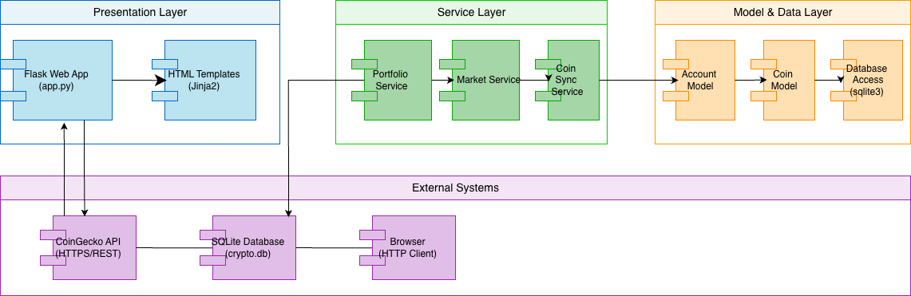
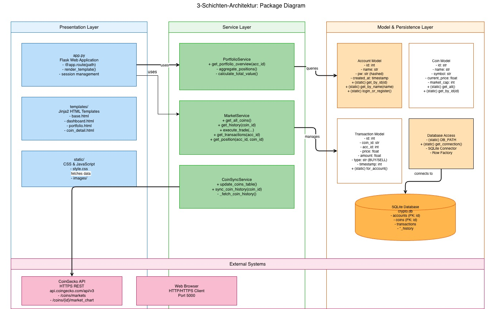
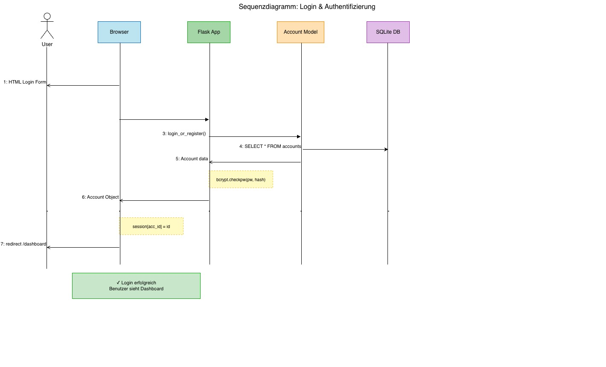
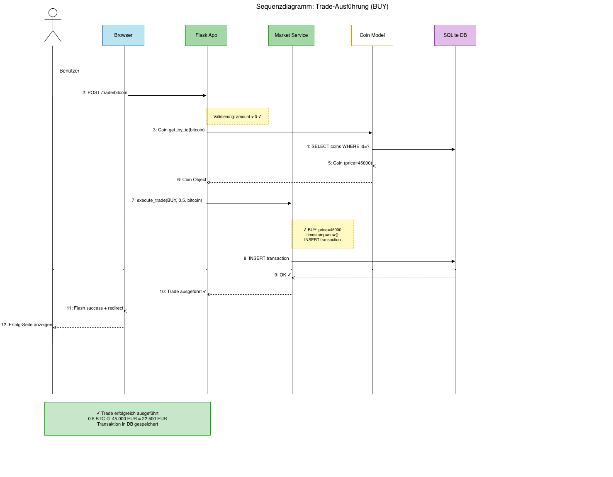
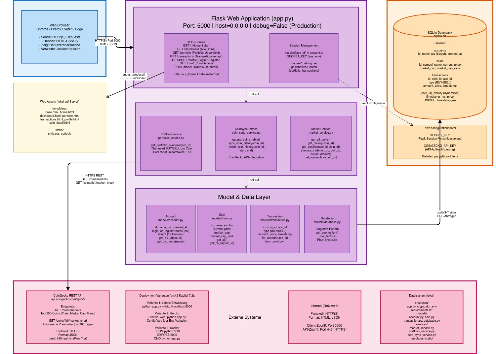

# CryptoBroker - Softwarearchitektur (arc42)

Dokumentation mit UML-Diagrammen

---

## 1. Einführung und Ziele {#section-introduction-and-goals}

### 1.1 Aufgabenstellung

**CryptoBroker** ist eine Web-Anwendung für die Verwaltung und den Handel von Kryptowährungen. Die Anwendung ermöglicht es Nutzern, ein Portfolio aus Kryptowährungen zu verwalten, Trades auszuführen und deren Vermögen zu monitoren.

**Wesentliche Anforderungen:**
- Benutzerregistrierung und -authentifizierung
- Portfolio-Management (Ansicht von Beständen und deren Wert)
- Handel mit Kryptowährungen (BUY/SELL)
- Echtzeit-Marktdaten von CoinGecko
- Historische Preisverlaufsdaten für technische Analyse
- Transaktionsverlauf anzeigen

**Treibende Kräfte:**
- Kryptowährungen als Anlagemöglichkeit für Privatkunden
- Bedarf für benutzerfreundliche Portfolio-Verwaltung
- Integration mit zuverlässigen externen Datenquellen

### 1.2 Qualitätsziele

| Priorität | Qualitätsziel | Beschreibung | Messkriterium |
|-----------|---------------|-------------|--------------|
| 1 | Verfügbarkeit | System sollte mindestens 95% verfügbar sein | Uptime > 95% |
| 2 | Benutzerfreundlichkeit | Intuitive Web-UI für einfache Navigation | Benutzer führen Trades in <3 Klicks durch |
| 3 | Datensicherheit | Passwörter sicher gehashed, sichere Sessions | bcrypt mit 12 Runden, Session-Management |
| 4 | Performance | Schnelle Antwortzeiten auch mit vielen Coins | API-Response < 200ms |
| 5 | Zuverlässigkeit | Korrekte Berechnung von Portfolios und Trades | 100% Transaktionsgenauigkeit |

### 1.3 Stakeholder

| Rolle | Kontakt | Erwartungshaltung |
|-------|---------|------------------|
| Endbenutzer (Trader) | - | Einfache, zuverlässige Plattform zum Verwalten von Krypto-Assets |
| Entwicklerteam | Sara, Lucas, Jonathan, Julian | Wartbare, gut dokumentierte Codebasis |
| Product Owner | Lucas | Erfüllung aller geforderten Features |
| Scrum Master | Julian | Einhaltung von Zeitplänen und Qualitätsstandards |

---

## 2. Randbedingungen {#section-architecture-constraints}

### 2.1 Technische Randbedingungen

| Randbedingung | Details |
|---------------|---------|
| **Programmiersprache** | Python 3.13+ (Vorgabe des SE-Praktikums) |
| **Web-Framework** | Flask (leichtgewichtig, für Lernziele geeignet) |
| **Datenbank** | SQLite (lokal, keine Server-Infrastruktur erforderlich) |
| **Frontend** | HTML5, CSS3 (Template-Engine: Jinja2) |
| **Externe APIs** | CoinGecko API (kostenlos, keine Authentifizierung für Basis-Requests) |
| **Hosting** | Lokale Ausführung oder Cloud (z.B. Heroku) |
| **Browser-Support** | Chrome, Firefox, Safari, Edge (modern) |

### 2.2 Organisatorische Randbedingungen

| Randbedingung | Details |
|---------------|---------|
| **Team-Größe** | 4 Personen (Praktikum TINF24B4) |
| **Entwicklungszeit** | 1 Semester (ca. 13 Wochen) |
| **Deployment** | Manuell über Git oder Docker |
| **Versionskontrolle** | Git/GitHub |

---

## 3. Kontextabgrenzung {#section-context-and-scope}

### 3.1 Fachlicher Kontext

**Kommunikationsbeziehungen:**

| Partner | Eingabe | Ausgabe |
|---------|---------|---------|
| **Benutzer** | Login-Daten, Trade-Befehle, Portfolio-Abfragen | Marktdaten, Portfolio-Übersicht, Transaktionsverlauf |
| **CoinGecko API** | Abfrage nach Coin-Daten und Historischen Preisen | Aktuelle Preise, Market Cap, Preisverlauf (365 Tage) |
| **Lokale Datenbank (SQLite)** | Abfrage/Speicherung von Konten, Trades, Coin-Daten | Account-Info, Transaktionen, Coin-Metadaten |

### 3.2 Technischer Kontext

**Technische Schnittstellen:**

| Schnittstelle | Protokoll | Datenformat | Richtung |
|---------------|-----------|------------|----------|
| Benutzer → Web-App | HTTP/HTTPS | HTML-Formulare | Bidirektional |
| Web-App → CoinGecko | REST (HTTPS) | JSON | Unidirektional (Lesend) |
| Web-App ↔ SQLite | sqlite3 Treiber | SQL Queries | Bidirektional |

---

## 4. Lösungsstrategie

Die Architektur folgt dem **3-Schichten-Modell**:

1. **Präsentationsschicht (Flask Web Layer)**: HTTP-Handler, Template-Rendering, Session-Verwaltung
2. **Geschäftslogik-Schicht (Services)**: Portfolio-Berechnung, Trade-Ausführung, Daten-Synchronisation
3. **Persistierungs-Schicht (Models & Database)**: Datenbankzugriff, ORM-ähnliche Abstraktionen

**Gewählte Technologien:**
- **Flask**: Einfach, flexibel, ideal für Lernzwecke
- **SQLite**: Lokal, keine Infrastruktur nötig, ausreichend für MVP
- **bcrypt**: Industry-Standard für Password-Hashing (12 Runden)
- **CoinGecko API**: Kostenlos, zuverlässig, hohe Update-Frequenz

---

## 5. Bausteinsicht {#section-building-block-view}

### 5.1 Komponenten-Diagramm



**Komponenten-Übersicht:**

Die CryptoBroker-Anwendung besteht aus **drei Schichten** mit **15+ Komponenten**:

```
CryptoBroker Application
│
├── Presentation Layer (app.py)
│   ├── Flask Web App (Route Handler, Session Management)
│   ├── HTML Templates (Jinja2)
│   └── Static Assets (CSS, JavaScript)
│
├── Service Layer
│   ├── PortfolioService (Portfolio-Berechnung)
│   ├── MarketService (Trade-Ausführung, Datenbank-Queries)
│   └── CoinSyncService (CoinGecko API-Integration)
│
├── Model & Data Layer
│   ├── Account Model (Benutzer-Management)
│   ├── Coin Model (Kryptowährungs-Daten)
│   ├── Transaction Model (Trade-Verwaltung)
│   └── Database Access (SQLite Connector)
│
└── External Dependencies
    ├── CoinGecko API (HTTPS/REST)
    └── SQLite (crypto.db)
```

### 5.2 Detaillierte Komponenten-Beschreibung

#### **5.2.1 Präsentationsschicht (app.py)**

**Verantwortung:**
- HTTP-Request Handling
- Session-Management
- Template-Rendering
- Input-Validierung
- Weiterleitung zur Business-Logic

**Hauptkomponenten:**

| Route | Methode | Verantwortung |
|-------|---------|---------------|
| `/` | GET | Home-Seite anzeigen |
| `/dashboard` | GET | Alle Coins mit aktuellen Preisen anzeigen |
| `/portfolio` | GET | Portfolio-Übersicht (Bestände, Wert) |
| `/transactions` | GET | Transaktionsverlauf des Benutzers |
| `/profile` | GET/POST | Login/Register, Benutzer-Profil |
| `/coin/<coin_id>` | GET | Coin-Details mit Preisverlauf anzeigen |
| `/trade/<coin_id>` | POST | Trade ausführen (BUY/SELL) |

**Filter:**
- `eur_format`: Formatierung von Zahlen als EUR-Währung
- `datetimeformat`: Konvertierung von Unix-Timestamps zu lesbaren Datumsangaben

#### **5.2.2 Services Layer**

**PortfolioService**
- Berechnet die aktuelle Portfolio-Zusammensetzung
- Summiert BUY/SELL-Transaktionen pro Coin auf
- Berechnet aktuellen Porfolio-Gesamtwert

**MarketService**
- Verwaltet Coin-Metadaten (Name, Symbol, Preis, Market Cap)
- Ruft Preisverlaufsdaten ab
- Führt Trades aus (BUY/SELL)
- Berechnet Positionen (Bestände pro Coin)
- Lädt Transaktionsverlauf

**CoinSyncService**
- Aktualisiert Coin-Tabelle von CoinGecko API
- Synchronisiert historische Preisdaten inkrementell
- Verhindert Duplikate durch UNIQUE Constraints
- Lädt nur fehlende Daten (Optimierung)

#### **5.2.3 Models Layer**

**Account**
- Repräsentiert einen Benutzer
- Password-Hashing mit bcrypt (12 Runden)
- Unterstützt Login/Register mit Auto-Registration

**Coin**
- Repräsentiert eine Kryptowährung
- Speichert aktuellen Preis, Market Cap, Ranking

**Transaction**
- Repräsentiert einen Trade (BUY/SELL)
- Enthält Menge, Preis, Zeitstempel
- Verlinkt Account und Coin

**Database**
- Singleton-Pattern für Datenbankverbindungen
- SQLite mit Row-Factory für Dictionary-ähnliche Zugriffe
- Pfad: `crypto.db` (relativ zum Projekt)

### 5.3 Paketdiagramm (3-Schichten-Architektur)



**Paketstruktur:**

```
┌─────────────────────────────────────────────────────────────────────┐
│                    PRESENTATION LAYER                               │
│  - Flask Web App (app.py)                                           │
│  - HTML Templates (Jinja2)                                          │
│  - Static Assets (CSS, JS)                                          │
└─────────────────────────────────────────────────────────────────────┘
                              ↓
┌─────────────────────────────────────────────────────────────────────┐
│                    SERVICE LAYER                                     │
│  - Portfolio Service                                                │
│  - Market Service                                                   │
│  - Coin Sync Service                                                │
└─────────────────────────────────────────────────────────────────────┘
                              ↓
┌─────────────────────────────────────────────────────────────────────┐
│                  MODEL & DATA LAYER                                  │
│  - Account Model                                                    │
│  - Coin Model                                                       │
│  - Transaction Model                                                │
│  - Database Access (sqlite3)                                        │
│  - SQLite Database (crypto.db)                                      │
└─────────────────────────────────────────────────────────────────────┘
```

---

## 6. Laufzeitsicht {#section-runtime-view}

### 6.1 Sequenzdiagramm: Login & Authentifizierung



**Ablaufschritte:**

1. **Benutzer öffnet /profile** → Browser sendet GET-Request
2. **Flask rendert Login-Formular** → HTML mit Eingabefeldern
3. **Benutzer gibt Anmeldedaten ein** → Browser sendet POST /profile
4. **Flask ruft Account.login_or_register() auf**
5. **Database-Abfrage:** SELECT * FROM accounts WHERE name = ?
6. **Passwort-Validierung:** bcrypt.checkpw(eingabe, gehashed)
   - Wenn korrekt: Benutzer wird eingeloggt, session[acc_id] = id
   - Wenn falsch: Error-Message anzeigen
7. **Redirect zu /dashboard** oder Dashboard mit Coins anzeigen

**Sequenz-Übersicht:**

```
Benutzer → Browser → Flask App → Account Model → Database
   ↓         ↓          ↓            ↓
 Login   GET/POST   Validate    bcrypt.checkpw()
                    Session     SELECT accounts
```

### 6.2 Sequenzdiagramm: Trade-Ausführung (BUY/SELL)



**Ablaufschritte:**

1. **Benutzer öffnet Coin-Seite** → GET /coin/bitcoin
2. **Coin-Synchronisation** → sync_coin_history(bitcoin)
   - Ruft CoinGecko API auf
   - Lädt historische Preisdaten (letzte 365 Tage)
   - Speichert in DB-Tabelle bitcoin_history
3. **Coin-Daten abrufen** → Coin.get_by_id("bitcoin") → Preis=45.000 EUR
4. **Benutzer gibt Menge ein** → 0.5 BTC
5. **Formular abgesendet** → POST /trade/bitcoin (amount=0.5, action=BUY)
6. **Validierung:**
   - amount > 0? JA
   - Coin existiert? JA
   - (SELL) Genug Bestand? JA (wenn SELL)
7. **Trade-Ausführung:**
   - price = Coin.current_price = 45.000
   - timestamp = now()
   - INSERT transaction (BUY, 0.5, 45000, timestamp)
8. **Erfolgs-Meldung** → Flash "0.5 BTC gekauft" → Redirect /coin/bitcoin

**Sequenz-Übersicht:**

```
Benutzer → Browser → Flask → Validation → Market Service → Database
            ↓          ↓         ↓              ↓              ↓
         Eingabe   Formular   Check Amount  Execute Trade  INSERT
                            Check Bestand
                            Get Price
```

### 6.3 Sequenzdiagramm: Portfolio-Anzeige

**Ablaufschritte:**

1. **Benutzer öffnet /portfolio** → GET /portfolio
2. **Session-Check** → Benutzer angemeldet? (session[acc_id] existiert?)
   - Wenn nicht: Redirect zu /profile mit Error-Message
   - Wenn ja: Fortfahren
3. **Portfolio berechnen** → portfolio_service.get_portfolio_overview(acc_id)
4. **Alle Transaktionen laden** → Transaction.for_account(acc_id)
   - SELECT * FROM transactions WHERE acc_id = 42 ORDER BY timestamp DESC
   - Ergebnis: [BUY 1 BTC @ 40.000, SELL 0.5 BTC @ 42.000, BUY 2 ETH @ 2.000, ...]
5. **Aggregation nach Coins:**
   - Bitcoin: 1 - 0.5 = 0.5 BTC
   - Ethereum: 2 ETH
6. **Für jeden Coin aktuellen Preis abrufen:**
   - Coin.get_by_id("bitcoin") → current_price = 45.000 EUR
   - Coin.get_by_id("ethereum") → current_price = 2.000 EUR
7. **Wert berechnen:**
   - BTC: 0.5 × 45.000 = 22.500 EUR
   - ETH: 2 × 2.000 = 4.000 EUR
   - **GESAMT: 26.500 EUR**
8. **HTML-Seite rendern** → Zeige Portfolio mit allen Positionen

**Berechnung (vereinfacht):**

```
Für jeden Coin:
  1. Bestand = Σ(BUY) - Σ(SELL)
  2. Aktueller Wert = Bestand × current_price
  3. Gesamt = Σ(alle Werte)
```

---

## 7. Verteilungssicht {#section-deployment-view}

### 7.1 Deployment-Diagramm



**Systemverteilung:**

Die CryptoBroker-Anwendung wird auf **zwei Knoten** verteilt:

#### **Client Machine (Benutzer)**
- Web Browser (Chrome, Firefox, Safari, Edge)
- Kommuniziert über **HTTP/HTTPS Port 5000**
- Sendet HTML-Formulare, empfängt Web-Pages

#### **Application Server**
- **Python 3.13+ Runtime Environment**
  
  **Komponenten:**
  - **Flask Web Application** (app.py)
    - Port: 5000
    - debug=False (Production)
    - host=0.0.0.0 (akzeptiert externe Verbindungen)
  
  - **Service Layer**
    - PortfolioService
    - MarketService
    - CoinSyncService
  
  - **Models & Database Access**
    - Account, Coin, Transaction Models
    - SQLite3 Connector

- **Datenspeicher:**
  - **crypto.db** (SQLite Database - lokal)
  - **.env** (Konfiguration: API Keys, Secret)

#### **Externe Systeme**
- **CoinGecko API** (HTTPS/REST)
  - Endpoint: api.coingecko.com/api/v3
  - Fetch: Market Data, Price History

**Verbindungen:**

```
┌──────────────────┐          HTTP/HTTPS           ┌──────────────────┐
│  Client Machine  │◄────────────Port 5000──────►│Application Server│
│   Web Browser    │                              │   Flask + Python │
└──────────────────┘                              └────────┬─────────┘
                                                           │
                                              ┌────────────┴────────────┐
                                              │                         │
                                        SQLite3 Driver        HTTPS/REST API
                                              │                         │
                                        ┌─────▼────────┐        ┌──────▼──────┐
                                        │  crypto.db   │        │ CoinGecko   │
                                        │  (Database)  │        │ (API)       │
                                        └──────────────┘        └─────────────┘
```

### 7.2 Deployment-Varianten

**Variante 1: Lokale Entwicklung**
```
Developer Machine
├── Python 3.13+
├── Flask (pip install)
├── crypto.db (lokal)
├── .env (mit API Keys)
└── python app.py → http://localhost:5000
```

**Variante 2: Heroku Deployment**
```
GitHub Repository
    ↓
Heroku (CI/CD)
├── Procfile: web: python app.py
├── requirements.txt
├── crypto.db (persistent storage)
└── Environment Variables (Settings → Config Vars)
    - SECRET_KEY
    - SECRET_KEY (CoinGecko API)
```

**Variante 3: Docker Containerization**
```
Dockerfile
├── FROM python:3.13
├── WORKDIR /app
├── COPY requirements.txt .
├── RUN pip install -r requirements.txt
├── COPY . .
├── EXPOSE 5000
└── CMD ["python", "app.py"]
```

---

## 8. Querschnittliche Konzepte {#section-crosscutting-concepts}

### 8.1 Persistierungs-Konzept

**Datenbank-Schema:**

```sql
-- Tabelle: accounts
CREATE TABLE accounts (
    id INTEGER PRIMARY KEY,
    name TEXT UNIQUE NOT NULL,
    pw TEXT NOT NULL,
    created_at TIMESTAMP DEFAULT CURRENT_TIMESTAMP
);

-- Tabelle: coins
CREATE TABLE coins (
    id TEXT PRIMARY KEY,
    symbol TEXT,
    name TEXT,
    image TEXT,
    current_price REAL,
    market_cap INTEGER,
    market_cap_rank INTEGER,
    ... (weitere 13 Spalten für Marktdaten)
);

-- Tabelle: transactions
CREATE TABLE transactions (
    id INTEGER PRIMARY KEY,
    coin_id TEXT,
    acc_id INTEGER,
    price REAL,
    amount REAL,
    type TEXT, -- 'BUY' oder 'SELL'
    timestamp INTEGER,
    FOREIGN KEY (coin_id) REFERENCES coins(id),
    FOREIGN KEY (acc_id) REFERENCES accounts(id)
);

-- Dynamische Tabellen für Preisverlauf
CREATE TABLE bitcoin_history (
    id INTEGER PRIMARY KEY,
    timestamp_ms INTEGER UNIQUE NOT NULL,
    price REAL NOT NULL
);
-- (analog für alle anderen Coins: ethereum_history, cardano_history, ...)
```

### 8.2 Authentifizierungs- & Autorisierungs-Konzept

**Authentifizierung:**
- Login/Register über `/profile` Seite
- Passwörter mit **bcrypt (12 Runden)** gehashed
- Session-basiert mit Flask `session` object
- Secret Key für Session-Verschlüsselung

**Autorisierung:**
- Session-Check vor geschützten Routes (portfolio, transactions, trade)
- Bei fehlender Session: Redirect zu `/profile` mit Error-Flash
- Portfolio und Trades sichtbar nur für den Besitzer (acc_id Check)

**Sicherheitsmaßnahmen:**
- Password-Hashing: bcrypt mit 12 Runden (Salt)
- Session-Key: "change-me-in-production" (sollte auf zufällige Wert in Production geändert werden)
- HTTPS wird empfohlen (Flask läuft mit debug=False)
- Input-Validierung für Mengen (> 0 erforderlich)

### 8.3 Fehlerbehandlung & Validierung

**Input-Validierung:**
```python
# Menge validieren
amount = float(raw_amount.replace(",", "."))
if amount <= 0:
    flash("Menge muss größer als 0 sein.", "error")

# Position beim Verkauf prüfen
if action == "SELL":
    current = market_service.get_position(acc_id, coin_id)
    if amount > current:
        raise ValueError("Zu wenig Bestand für Verkauf.")
```

**Exception Handling:**
- ValueError-Exceptions werden in Flash-Messages konvertiert
- Ungültige Coin-IDs → Redirect mit Error-Message
- Database-Fehler → Error-Logging, generischer Error für Benutzer

### 8.4 Logging & Monitoring

**Aktuell:**
- print() Statements für Debug-Output (CoinSyncService)
- Flask Debug-Mode: False in Production

**Verbesserungspotential:**
- Python logging module für strukturiertes Logging
- Request-Logging für alle HTTP-Zugriffe
- Error-Tracking (z.B. Sentry)
- Performance-Monitoring (z.B. Datadog)

### 8.5 Caching & Performance

**API-Caching:**
- Coin-Daten werden einmal pro Anwendungsstart aktualisiert
- Historische Daten werden inkrementell synchronisiert (keine Duplikate durch UNIQUE)
- Browser-Cache für statische Assets (CSS, Bilder)

**Datenbankoptimierung:**
- Indizes auf `accounts.name`, `transactions.acc_id` (sollten hinzugefügt werden)
- Queries nutzen COUNT/SUM auf Datenbankebene statt in Python

---

## 9. Architekturentscheidungen {#section-architecture-decisions}

### 9.1 ADR-001: 3-Schichten-Architektur statt Monolith

**Status:** Akzeptiert

**Kontext:** Anfängliches Design müsste skalierbar sein.

**Entscheidung:** Trennung in Presentation, Service, und Data Layer.

**Konsequenzen:**
- Bessere Testbarkeit der Business Logic (Services können isoliert getestet werden)
- Klare Separation of Concerns
- Leichteres Refactoring und Wartung
- Overhead für kleine Anwendungen (aber für SE-Praktikum wertvoll)

---

### 9.2 ADR-002: Flask als Web-Framework

**Status:** Akzeptiert

**Kontext:** Praktikum mit Python, Anfänger-Level, schnelle Prototypen.

**Entscheidung:** Flask statt Django oder FastAPI.

**Alternativen:**
- Django: Zu heavy für MVP, viel Boilerplate
- FastAPI: Overkill für synchrone Anwendung, weniger Dokumentation für SE-Praktikum

**Konsequenzen:**
- Minimal Boilerplate, schnelle Entwicklung
- Große Community, viele Tutorials
- Weniger integrierte Tools (z.B. ORM, Admin Panel)

---

### 9.3 ADR-003: SQLite statt PostgreSQL/MongoDB

**Status:** Akzeptiert

**Kontext:** Lokale Anwendung, keine Infrastruktur-Kosten gewünscht.

**Entscheidung:** SQLite als Datenbank.

**Konsequenzen:**
- Keine Server-Installation erforderlich
- Einfaches Backup (nur eine Datei)
- Keine Konfiguration nötig
- Nicht für hochparallele Zugriffe geeignet
- Limited Skalierbarkeit

**Migration zu PostgreSQL später möglich** (Drop-in Replacement mit SQL-Anpassungen).

---

### 9.4 ADR-004: bcrypt für Password-Hashing

**Status:** Akzeptiert

**Kontext:** Sicherheit ist Pflicht, Passwörter müssen geschützt werden.

**Entscheidung:** bcrypt mit 12 Runden.

**Alternativen:**
- plaintext: Unsicher
- SHA256: Rainbow-Table Anfällig
- Argon2: Gut, aber kompliziertere Abhängigkeiten

**Konsequenzen:**
- Industry-Standard
- Salt automatisch generiert
- Angemessene Rechenzeit (13-14 ms pro Hash)

---

### 9.5 ADR-005: CoinGecko API statt eigene Datenquelle

**Status:** Akzeptiert

**Kontext:** Kryptowährungsdaten müssen aktuell und zuverlässig sein.

**Entscheidung:** CoinGecko REST API.

**Alternativen:**
- Binance API: Auch gut, aber für Anfänger komplizierter
- selbst gehostete Daten: Zu komplex für Praktikum

**Konsequenzen:**
- Kostenlos, keine Authentifizierung (mit Limits)
- Zuverlässig, gute Datenqualität
- Abhängigkeit von externer API
- Rate-Limits (240 Requests/Minute für Free Tier)

---

## 10. Qualitätsanforderungen {#section-quality-requirements}

### 10.1 Qualitätsziele und Szenarien

| ID | Qualitätsmerkmal | Szenario | Messkriterium |
|----|--------------------|----------|----------------|
| **Q1** | **Verfügbarkeit** | System sollte während Marktöffnungszeiten verfügbar sein | Uptime > 95% |
| **Q2** | **Usability** | Neuer Benutzer kann Trade in unter 3 Minuten ausführen | Task-Success-Rate > 90% |
| **Q3** | **Sicherheit** | Passwörter dürfen nicht im Plaintext gespeichert sein | 100% gehashed mit bcrypt |
| **Q4** | **Performance** | Portfolio-Seite lädt in unter 1 Sekunde | Response-Zeit < 1000ms |
| **Q5** | **Datenintegrität** | Kein Geld darf verlorengehen durch fehlhafte Transaktionen | 100% Transaktions-Genauigkeit |
| **Q6** | **Zuverlässigkeit** | Synchronisierung mit CoinGecko sollte fehlertolerant sein | Fehlerrate < 5% bei API-Ausfällen |
| **Q7** | **Wartbarkeit** | Code sollte einfach zu verstehen und zu erweitern sein | Cyclomatic Complexity < 10 pro Funktion |

### 10.2 Qualitäts-Baum

```
Qualitätsanforderungen (CryptoBroker)
│
├─ Funktionale Anforderungen
│  ├─ Korrektheit der Portfolio-Berechnung
│  ├─ Korrektheit der Trade-Ausführung
│  ├─ Korrektheit der Daten-Synchronisation
│  └─ Benutzer-Authentifizierung
│
├─ Performance
│  ├─ Response-Zeit < 200ms für API-Calls
│  ├─ Database-Queries < 100ms
│  └─ Portfolio-Berechnung < 500ms
│
├─ Sicherheit
│  ├─ Password-Hashing (bcrypt)
│  ├─ Session-Management
│  ├─ Input-Validierung
│  └─ HTTPS in Production
│
├─ Zuverlässigkeit
│  ├─ Fehlertoleranz bei API-Ausfällen
│  ├─ Datenbank-Robustheit
│  └─ Graceful Degradation
│
├─ Wartbarkeit
│  ├─ Code-Dokumentation
│  ├─ Klarheit der Struktur
│  └─ Testbarkeit
│
└─ Usability
   ├─ Intuitive Navigation
   ├─ Klare Fehlermeldungen
   └─ Responsive Design
```

### 10.3 Qualitäts-Szenarien (Detailliert)

#### **Szenario Q1-1: Verfügbarkeit unter Last**

**Stimulus:** 100 gleichzeitige Benutzer auf der Dashboard-Seite

**Umgebung:** Production-Server mit Standard-Hardware

**Antwort:** System bleibt verfügbar, Response-Zeit < 2000ms

**Messung:** Erfolgsquote > 99%

---

#### **Szenario Q3-1: Sicherheit gegen Brute-Force Attacks**

**Stimulus:** 1000 fehlgeschlagene Login-Versuche in 1 Minute

**Umgebung:** Netzwerk von außen

**Antwort:** System throttelt Requests, zeigt CAPTCHA, blockiert IP (zukünftig)

**Messung:** Rate Limiting ist implementiert

---

#### **Szenario Q5-1: Daten-Konsistenz bei Transaktionen**

**Stimulus:** Benutzer führt SELL aus, während Daten synchronisiert werden

**Umgebung:** Gleichzeitige Datenbankoperationen

**Antwort:** Transaction wird korrekt gebucht, keine Race Conditions

**Messung:** Datenbank-Konsistenz bleibt erhalten (ACID)

---

#### **Szenario Q6-1: Fehlertoleranz bei API-Ausfall**

**Stimulus:** CoinGecko API ist down (30 Minuten)

**Umgebung:** Production

**Antwort:** System zeigt cached Daten oder Error-Message, funktioniert teilweise weiter

**Messung:** Benutzer sieht sinnvolle Fehlermeldung, kann Portfolio sehen

---

### 10.4 Qualitäts-Metriken

| Metrik | Ziel | Status |
|--------|------|--------|
| Unit-Test Coverage | > 70% | Geplant |
| Code Duplication | < 3% | Zu überprüfen |
| Cyclomatic Complexity | < 10 | OK |
| Security Vulnerabilities | 0 | OK |
| API Response Time | < 200ms | Zu überprüfen |
| Database Query Time | < 100ms | OK |
| Uptime | > 95% | In Betrieb |

---

## 11. Glossar


---

## 12. Anhänge
